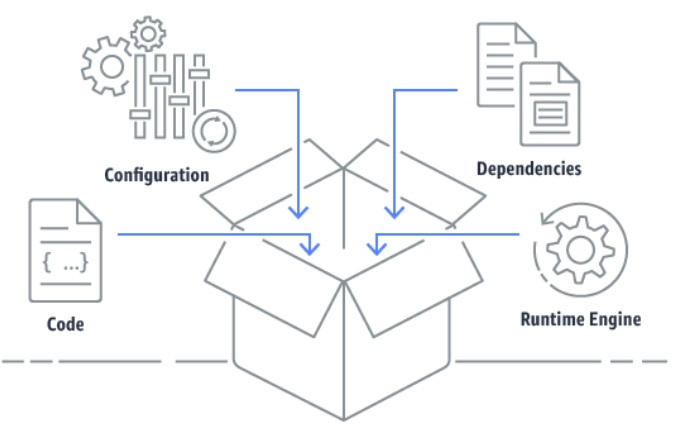
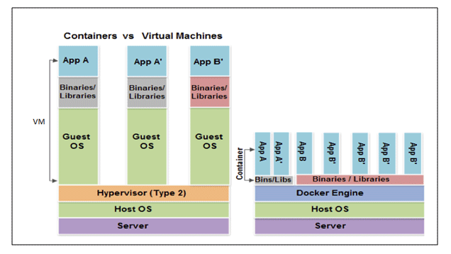
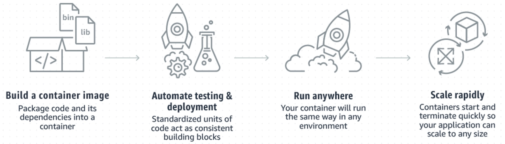
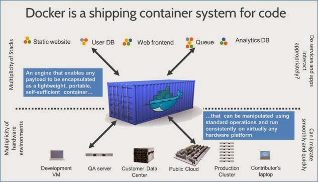
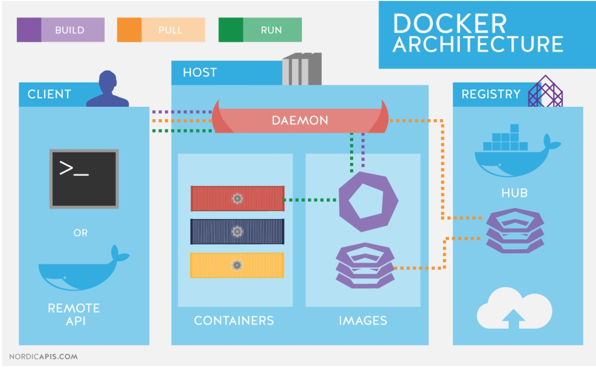

= Container and it's Orchestration
:toc:
:toclevels: 3
:toc-placement!:

toc::[]

This project describes about how to deploy a spring boot-monogo db java based micro service application
on *Kubernetes* using docker container.

== Overview

=== What is Container? What problem do they solve?
Container is a lightweight, stand-alone executable package of a peace of software which provides a way to package our application code, configuration, runtime, system tools & libraries.

Containers are a solution to the problem of how to get software to run reliably when moved from one computing environment to another. This could be from a developer's laptop to a test environment, from a staging environment into production, and perhaps from a physical machine in a data center to a virtual machine in a private or public cloud.

[blue]#Problem Statement:#

Lets say you've developed your application on Mac OS laptop which has JRE8 and Oracle11g DB as underlined database (as per your project environment plan). You tested your application locally which is working fine, then after you deployed your changes in QA environment and Stage environments which has equivalent JRE version and Oracle DB. But due to few issues your production environment didn't upgrade to JRE8 & Oracle11g!! What would be the case if you deploy your application changes to production (runs on linux OS).

[blue]#How do containers solve above problem?#

As we discussed, a container consists of entire runtime environment; application code, all dependencies, libraries, binaries and configuration files bundled them into to one package and container will take of running this package on underlined system.

==== Container vs VM

==== Memory management
image::images/virtual-machine-vs-docker-memomy.png[]

==== How container works?

=== Why only [blue]#Docker#, not others?

Docker is an open source application container platform designed for Linux and, more recently, Windows, Apple and mainframe OSes. Docker utilizes resource isolation features, such as cgroups and Linux kernels, to create isolated containers.

A docker container is lightweight, standard and secured compare to other competitors (Rkt, LXD, OpenVZ, LinuxVServer, Windows containers).

=== Docker Architecture & components
To allow for an application to be self-contained the Docker approach moves up the abstraction of resources from the hardware level to the Operating System level.

* [blue]#Docker daemon:# The daemon is responsible for all container related actions and receives commands via the CLI or the REST API.
* [blue]#Docker Client:# A Docker client is how users interact with Docker. The Docker client can reside on the same host as the daemon or a remote host.
* [blue]#Docker Objects:# Objects are used to assemble an application. Apart from networks, volumes, services, and other objects the two main requisite objects are:
* [blue]#Images:# The read-only template used to build containers. Images are used to store and ship applications.
* [blue]#Containers:# Containers are encapsulated environments in which applications are run. A container is defined by the image and configuration options. At a lower level, you have containerd, which is a core container runtime that initiates, and supervises container performance.
* [blue]#Docker Registries:# Registries are locations from where we store and download (or “pull”) images.

.Docker Competitors
|===
||Rkt|LXD|OpenVZ|LinuxVServer|Windows Containers

|Compared to Docker
|Focuses on compatibility, hence it supports multiple container formats, including Docker images and its own format. Like Docker, it is optimized for application containers, not full-system containers and has fewer third-party integrations available.
|Emulates the experience of operating Virtual Machines but in terms of containers and does so without the overhead of emulating hardware resources. While the LXD daemon requires a Linux kernel it can be configured for access by a Windows or macOS client.
|An extension of the Linux kernel, which provides tools for virtualization to the user. It uses Virtual Environments to host Guest systems, which means it uses containers for entire operating systems, not individual applications and processes.
|Uses a patched kernel to provide operating system-level virtualization features. Each of the Virtual Private Servers is run as an isolated process on the same host system and there is a high efficiency as no emulation is required. However, it is archaic in terms of releases, as there have been none since 2007.
|The Docker Engine for Windows Server 2016 directly accesses the windows kernel. Hence native Docker containers cannot be run on Windows Containers. Instead, a different container format, WSC (Windows Server Container), is to be used.

|Use Cases
|Public cloud portability, Stateful app migration, and Rapid Deployment.
|Bare-metal hardware access for VPS, multiple Linux distributions on the same host.
|CI/CD and DevOps, Containers and big data, Hosting Isolated Set of User Applications, Server consolidation.
|Multiple VPS Hosting and Administration, and Legacy support.
|

|Adoption
|Moderate
|Low
|Low
|Low - Moderate (Mostly Legacy Hosting)
|
|===

////
Disadvantages of containers
A potential drawback of containerization is lack of isolation from the host OS. Because containers share a host OS, security threats have easier access to the entire system when compared with hypervisor-based virtualization. One approach to addressing this security concern has been to create containers from within an OS running on a VM. This approach ensures that, if a security breach occurs at the container level, the attacker can only gain access to that VM's OS, not other VMs or the physical host.
Another disadvantage of containerization is the lack of OS flexibility. In typical deployments, each container must use the same OS as the base OS, whereas hypervisor instances have more flexibility. For example, a container created on a Linux-based host could not run an instance of the Windows Server OS or applications designed to run on Windows Server.
Monitoring visibility can be another issue. With possibly up to hundreds or more containers running on a server, it may be difficult to see what is happening in each container.
////

=== Docker installation and basic steps to create an image

We can install docker by downloading dmg (mac supported file) or brew command line support.

Mac: https://docs.docker.com/docker-for-mac/install/
Windows: https://docs.docker.com/docker-for-windows/install/

Brew: brew cask install docker

Basic steps

. docker --version : displays installed docker version
. docker run hello-world: Basic application deployed on your docker
. Go to application directory and run "./gradlew clean build"
. Run ./gradlew unpack (Optional based on your Dockerfile version)
. Run "docker build -t docker-react-demo . “: Will create docker image (application must have link:Dockerfile[])

=== What is Container orchestration?
Containerisation has brought a lot of flexibility for developers in terms of managing the deployment of the applications. However, the more granular the application is, the more components it consists of and hence requires some sort of management for those.

A cluster would be a coupled network of containers connected in such a way they can freely communicate with each other.

=== Why Kubernetes?
Kubernetes is a mature container orchestrator that runs in the same market as Docker Swarm and Apache Mesos. In Kubernetes, containers are grouped together into pods based on logical dependencies which can then be easily scaled at runtime.

=== Kubernetes Architecture

image::/images/K8SArch.png[]
_Source:_ link:https://x-team.com[x-team]
//https://x-team.com/blog/introduction-kubernetes-architecture/

The machine on which a cluster is running can either be Masters or Nodes. The naming makes sense. The Master is the control panel of the whole cluster. All commands we will run will be run on the Master instance. It will then decide which Node, or worker machine, in the cluster will take the workload.

==== Master node:
The master node is responsible for the management of Kubernetes cluster. This is the entry point of all administrative tasks. The master node is the one taking care of orchestrating the worker nodes, where the actual services are running.

* [blue]#API Server:# The API server is the entry points for all the REST commands used to control the cluster. It processes the REST requests, validates them, and executes the bound business logic. It is designed to scale horizontally – that is, it scales by deploying more instances. See link:https://kubernetes.io/docs/setup/independent/high-availability/[Building High-Availability Clusters].

    ** The API Server is also responsible for the authentication and authorization mechanism. All API clients should be authenticated in order to interact with the API Server.
    ** The API Server is the only Kubernetes component that connects to etcd; all the other components must go through the API Server to work with the cluster state.
    ** The API Server also implements a watch mechanism (similar to etcd) for clients to watch for changes. This allows components such as the Scheduler and Controller Manager to interact with the API Server in a loosely coupled manner.
* [blue]#etcd storage:# It's a simple, distributed, consistent key-value store. It’s mainly used for shared configuration and service discovery.
    ** It provides a REST API for CRUD operations as well as an interface to register watchers on specific nodes, which enables a reliable way to notify the rest of the cluster about configuration changes.
    ** Etcdctl is the command-line interface tool written in Go that allows manipulating an etcd cluster. It can be used to perform a variety of actions, such as:

       a command line tool to communicate with the API service and send commands to the master node.Set, update and remove keys.
       Verify the cluster health.
       Add or remove etcd nodes.
       Generating database snapshots.

* [blue]#Controller Manager:# The Kubernetes Controller Manager is a daemon that embeds the core control loops (also known as “controllers”) shipped with Kubernetes. Basically, a controller watches the state of the cluster through the API Server watch feature and, when it gets notified, it makes the necessary changes attempting to move the current state towards the desired state. Besides, the Controller Manager performs lifecycle functions such as namespace creation and lifecycle, event garbage collection, terminated-pod garbage collection, cascading-deletion garbage collection, node garbage collection, etc.
    ** *_Node Controller:_* Responsible for noticing and responding when nodes go down.
    ** *_Replication Controller:_* Responsible for maintaining the correct number of pods for every replication controller object in the system.
    ** *_Endpoints Controller:_* Populates the Endpoints object (that is, joins Services & Pods).
    ** *_Service Account & Token Controllers:_* Create default accounts and API access tokens for new namespaces.

* [blue]#scheduler:# Component on the master that watches newly created pods that have no node assigned via the /binding pod subresource API, according to the availability of the requested resources, quality of service requirements, and selects a node for them to run on. Once the pod has a node assigned, the regular behavior of the Kubelet is triggered and the pod and its containers are created.

==== Worker node:
The pods are run here, so the worker node contains all the necessary services to manage the networking between the containers, communicate with the master node, and assign resources to the containers scheduled.

* [blue]#kubelet:# An agent that runs on each node in the cluster. It gets the configuration of a pod from the apiserver and ensures that the described containers are up and running in a pod.
    ** The kubelet takes a set of PodSpecs that are provided through various mechanisms and ensures that the containers described in those PodSpecs are running and healthy. The kubelet doesn’t manage containers which were not created by Kubernetes.
    ** This is the worker service that’s responsible for communicating with the master node.
       It also communicates with etcd, to get information about services and write the details about newly created ones

* [blue]#kube-proxy:# kube-proxy enables the Kubernetes service abstraction by maintaining network rules on the host and performing connection forwarding. In other words, acts as a network proxy and a load balancer for a service on a single worker node. It takes care of the network routing for TCP and UDP packets.

* [blue]#Pod:# A group of one or more containers (such as Docker containers), with shared storage/network, and a specification for how to run the containers. Even if the pod has several containers, they will all be reachable in the network through a single IP address.

* [blue]#Service:# An abstraction which defines a logical set of Pods and a policy by which to access them. Pods have a life cycle. They get created and die. We need a way to make them accessible on a regular basis, even if they are re-created. By giving Pods a certain label we use a Service to route traffic to all Pods with that particular label. Voila! Reliable access to Pods even if they are re-created.

* [blue]#ReplicaSet:# Give Pods a label and control their replication. Nowadays they are only used through Deployments.

* [blue]#Deployment:# Describes the desired state and makes sure to change the actual state to the desired state if needed. A deployment manages Pods and ReplicaSets so you don’t have to. Just like magic!

// Ref: https://x-team.com/blog/introduction-kubernetes-architecture/

==== kubectl:
A command line tool to communicate with the API service and send commands to the master node.

==== Key features of Kubernetes

* Replication of components

    Controlling resource consumption by application or team.
    Automatically leveraging additional resources made available when a new host is added to the cluster.
    Moving an application instance from one host to another if there is a shortage of resources in a host, or if the host dies.

* Auto-scaling

    Monitoring resource consumption and resource limits to automatically stop applications from consuming too many resources and restarting the applications again.

* Load balancing

    Automatically load balancing requests across the different instances of an application

* Rolling updates

    Easily performing canary deployments and rollbacks.

* Logging across components

    Kubernetes provides no native storage solution for log data, but you can integrate many existing logging solutions into your Kubernetes cluster.

    Basic logging in Kubernetes
    Logging at the node level
    Cluster-level logging architectures

    Ref: https://kubernetes.io/docs/concepts/cluster-administration/logging/

* Monitoring and health checking

    Kubernetes provides detailed information about an application’s resource usage at each of these levels. This information allows you to evaluate your application’s performance and where bottlenecks can be removed to improve overall performance.

    Resource metrics pipeline
    Full metrics pipelines
    CronJob monitoring

    Ref: https://kubernetes.io/docs/tasks/debug-application-cluster/resource-usage-monitoring/

* Cost effective

 Kubernetes and containers allow for much better resource utilization than hypervisors and VMs do. Because containers are so lightweight, they require less CPU and memory resources to run.

* Portable

 Amazon Web Services (AWS), Microsoft Azure, and the Google Cloud Platform (GCP), and you can also run it on-premise. You can move workloads without having to redesign your applications or completely rethink your infrastructure, which lets you standardize on a platform and avoid vendor lock-in.

* Service discovery

    Service discovery is the process of figuring out how to connect to a service. While there is a service discovery option based on environment variables available, the DNS-based service discovery is preferable. Note that DNS is a cluster add-on so make sure your Kubernetes distribution provides for one or install it yourself.

    CoreDNS is a flexible, extensible DNS server that can serve as the Kubernetes cluster DNS. Like Kubernetes, the CoreDNS project is hosted by the CNCF.

    Ref: https://kubernetes.io/docs/tasks/administer-cluster/coredns/

* Security

    Kubernetes supports below security levels.

    Transport Security
    Authentication
    Authorization
    Admission Control
    API Server Ports and IPs

    Ref: https://kubernetes.io/docs/reference/access-authn-authz/controlling-access/

