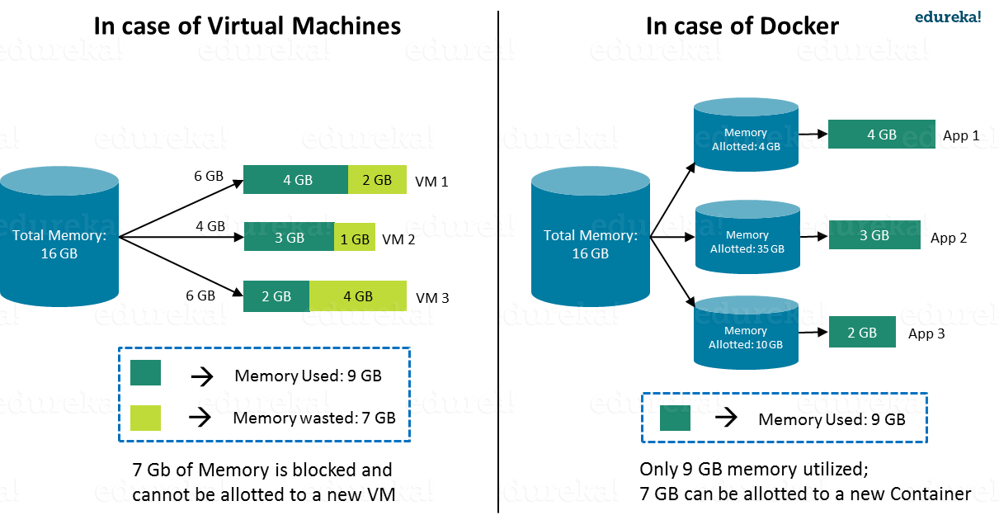

= Container and it's Orchestration
:toc:
:toclevels: 3
:toc-placement!:

toc::[]

This project describes about how to deploy a spring boot-monogo db java based micro service application
on *Kubernetes* using docker container.

== Overview

=== What is Container? What problem do they solve?
Container is a lightweight, stand-alone executable package of a peace of software which provides a way to package our application code, configuration, runtime, system tools & libraries.

image::images/Container.jpg[]

=== Why only [blue]#Docker#, not others?

=== VM vs Docker

image::images/Containers-vs-Virtual-Machines.gif[]

=== What is Container orchestration?
Containerisation has brought a lot of flexibility for developers in terms of managing the deployment of the applications. However, the more granular the application is, the more components it consists of and hence requires some sort of management for those.

A cluster would be a coupled network of containers connected in such a way they can freely communicate with each other.

=== Why Kubernetes?
Kubernetes is a mature container orchestrator that runs in the same market as Docker Swarm and Apache Mesos. In Kubernetes, containers are grouped together into pods based on logical dependencies which can then be easily scaled at runtime.

=== Kubernetes Architecture

image::/images/K8SArch.png[]

* Node

The machine on which a cluster is running can either be Masters or Nodes. The naming makes sense. The Master is the control panel of the whole cluster. All commands we will run will be run on the Master instance. It will then decide which Node, or worker machine, in the cluster will take the workload.

* Pod

A group of one or more containers (such as Docker containers), with shared storage/network, and a specification for how to run the containers. Even if the pod has several containers, they will all be reachable in the network through a single IP address.

* Service 

An abstraction which defines a logical set of Pods and a policy by which to access them. Pods have a life cycle. They get created and die. We need a way to make them accessible on a regular basis, even if they are re-created. By giving Pods a certain label we use a Service to route traffic to all Pods with that particular label. Voila! Reliable access to Pods even if they are re-created.

* ReplicaSet 

Give Pods a label and control their replication. Nowadays they are only used through Deployments.

* Deployment 

Describes the desired state and makes sure to change the actual state to the desired state if needed. A deployment manages Pods and ReplicaSets so you don’t have to. Just like magic!

==== Key features of Kubernetes

* Replication of components

    Controlling resource consumption by application or team.
    Automatically leveraging additional resources made available when a new host is added to the cluster.
    Moving an application instance from one host to another if there is a shortage of resources in a host, or if the host dies.

* Auto-scaling

    Monitoring resource consumption and resource limits to automatically stop applications from consuming too many resources and restarting the applications again.

* Load balancing

    Automatically load balancing requests across the different instances of an application

* Rolling updates

    Easily performing canary deployments and rollbacks.

* Logging across components

    Kubernetes provides no native storage solution for log data, but you can integrate many existing logging solutions into your Kubernetes cluster.

    Basic logging in Kubernetes
    Logging at the node level
    Cluster-level logging architectures

    Ref: https://kubernetes.io/docs/concepts/cluster-administration/logging/

* Monitoring and health checking

    Kubernetes provides detailed information about an application’s resource usage at each of these levels. This information allows you to evaluate your application’s performance and where bottlenecks can be removed to improve overall performance.

    Resource metrics pipeline
    Full metrics pipelines
    CronJob monitoring

    Ref: https://kubernetes.io/docs/tasks/debug-application-cluster/resource-usage-monitoring/

* Cost effective

 Kubernetes and containers allow for much better resource utilization than hypervisors and VMs do. Because containers are so lightweight, they require less CPU and memory resources to run.

* Portable

 Amazon Web Services (AWS), Microsoft Azure, and the Google Cloud Platform (GCP), and you can also run it on-premise. You can move workloads without having to redesign your applications or completely rethink your infrastructure, which lets you standardize on a platform and avoid vendor lock-in.

* Service discovery

    Service discovery is the process of figuring out how to connect to a service. While there is a service discovery option based on environment variables available, the DNS-based service discovery is preferable. Note that DNS is a cluster add-on so make sure your Kubernetes distribution provides for one or install it yourself.

    CoreDNS is a flexible, extensible DNS server that can serve as the Kubernetes cluster DNS. Like Kubernetes, the CoreDNS project is hosted by the CNCF.

    Ref: https://kubernetes.io/docs/tasks/administer-cluster/coredns/

* Security

    Kubernetes supports below security levels.

    Transport Security
    Authentication
    Authorization
    Admission Control
    API Server Ports and IPs

    Ref: https://kubernetes.io/docs/reference/access-authn-authz/controlling-access/

===
